# InuaDada-Foundation
A Foundation envisions on global community that empowers, upholds the dignity and protects the rights of every girl child and extends that to her caregivers and community.
Our story began on August 26th 2013, with an emotive feature titled “Period of Shame” on Citizen TV, which caught the attention of many people, our founder, Janet Mbugua, included. 
# InuaDada-Foundation Android Application
Based on the Foundation above by Janet Mbugua. I have developed an android appplication that can easily be used and has as much features as the website platform being used.
## Technologies used
* Java- `Backend.`
* Xmls- `Frontend.`
* Gradle- `(For Project building).`
* Junit- `Testing`

# Screenshots
# Onboarding screens
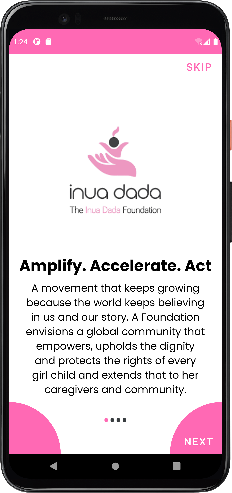 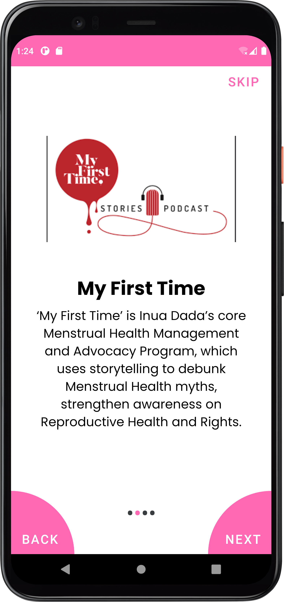
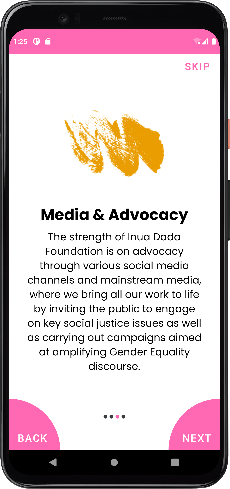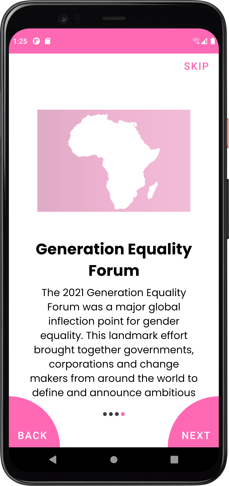
# Homescreens
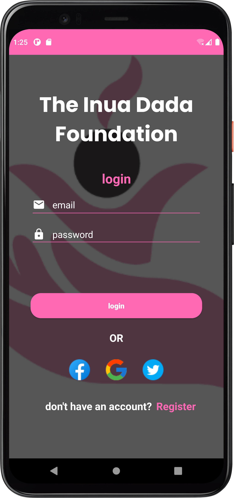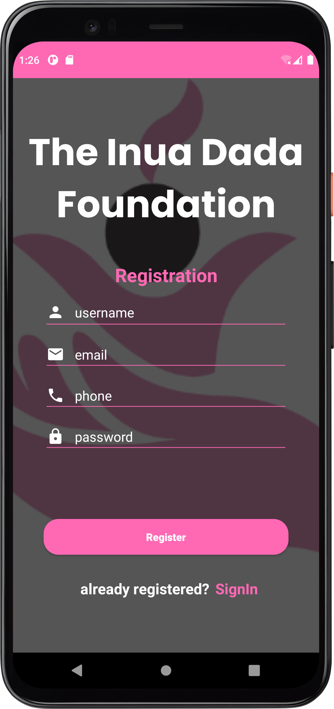
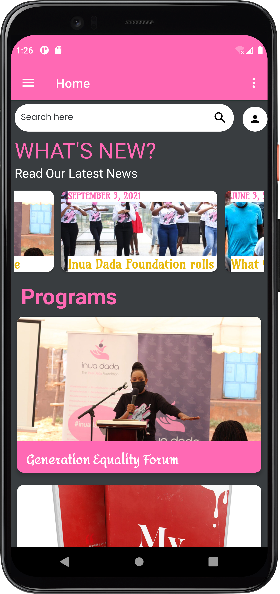
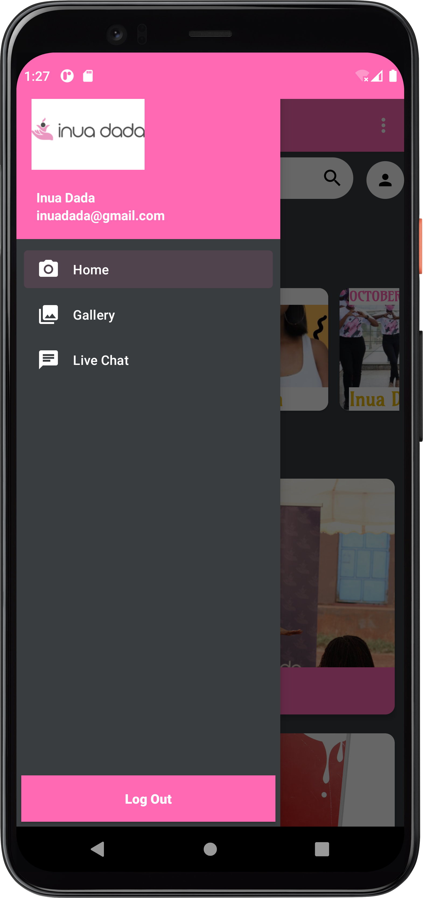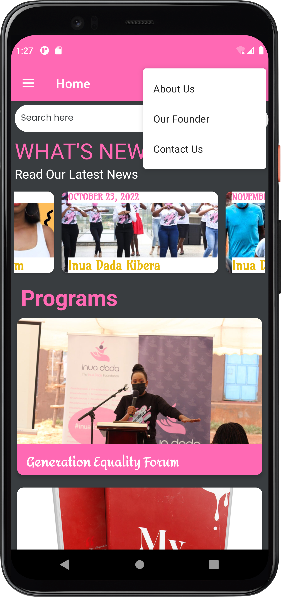
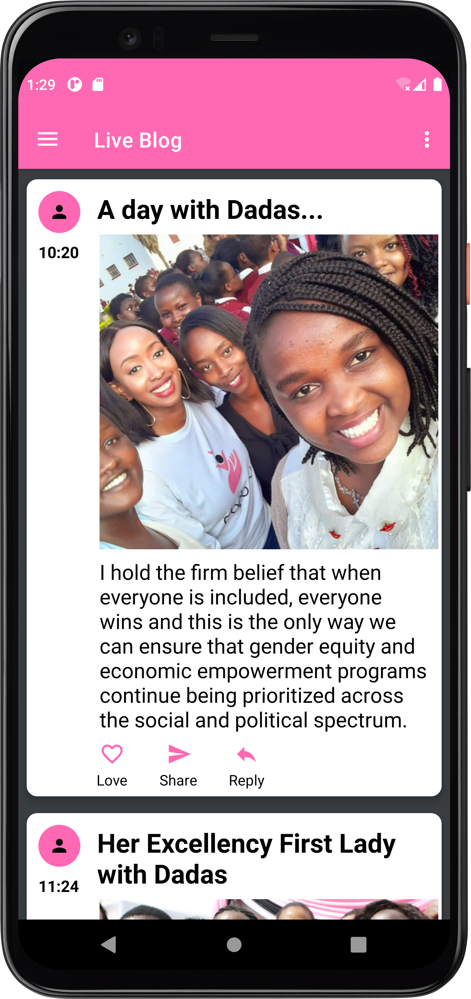
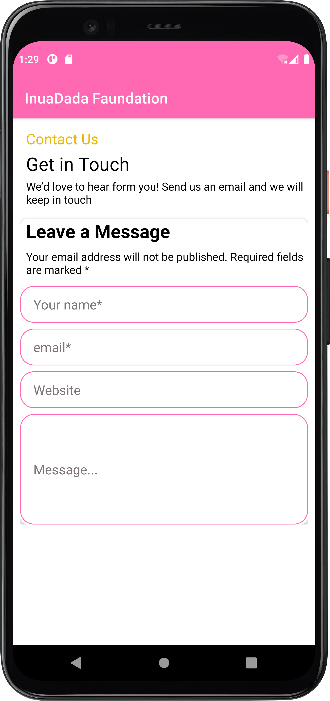

## Prerequisites
- Basic java, Android Studio and Git knowledge, including an installed version of Git.
- Your application must run on the OpenJDK version 11 onwards.

## Setup & Installation
* Clone the project into your machine from `https://github.com/InuaDada-Foundation.git`
* Run the project in the forked root folder- gradle run.

## Development
Want to contribute? Great!
To fix a bug or enhance an existing module, follow these steps:

- Fork the repo
- Create a new branch (`git checkout -b improve-feature`)
- Make the appropriate changes in the files
- Add changes to reflect the changes made
- Commit your changes (`git commit -am 'Improve feature'`)
- Push to the branch (`git push origin improve-feature`)
- Create a Pull Request
